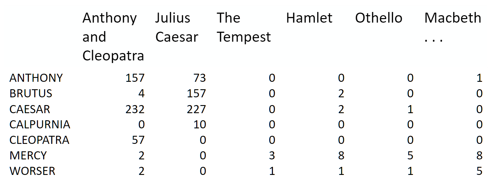
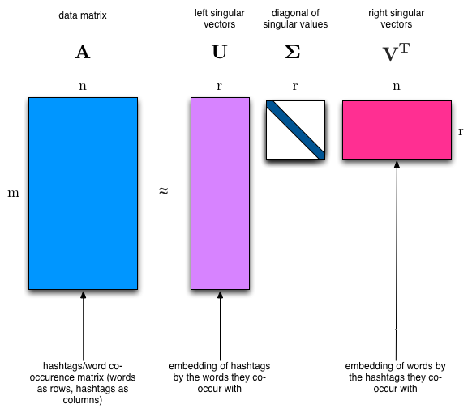

# Topic Modeling with NMF, SVD
주제 모델링은 행렬 분해에 대해 시작하기 가장 좋은 방법이다. 우리는 해당 행렬로 시작한다.

우리는 이 행렬을 하나의 길고 가는 행렬 또는 하나의 넓고 짧은 행렬로 분해할 수 있다.

두 벡터의 outer product를 사용하여 행렬을 재구성하는 가장 극단적인 케이스를 생각하자. 명확하게 대부분의 케이스에서 우리는 행렬을 정확하게 재구성할 수 없을 것이다.
하지만 만약 우리가 전체적인 단어의 수 중 상대적인 빈도를 가진 벡터가 하나 있고, 문서당 평균 단어 수를 가진 벡터가 하나 있다면, 그 outer product는 우리가 얻을 수 있는 한 근접할 것이다.

이제 해당 행렬을 2개의 열과 2개의 행으로 늘리는 것을 고려하자. 최적의 분해는 2개의 그룹으로 묶는 것이고, 각 그룹은 가능한 서로 다른 분포를 가지지만 클러스터에 있는 문서들 사이에서 가능한 한 유사할 것이다.
우리는 이 2개의 그룹들을 "topics"라고 부르고, 우리는 각각의 주제에 가장 많이 등장하는 단어들을 바탕으로 단어들을 2개의 그룹으로 묶을 것이다.

## In today's class
우리는 각각의 다른 카테고리 내의 documents 의 데이터 셋을 취하고, 그들의 topic을 찾을 것이다.진짜 카테고리를 아는 것은 우리가 찾은 주제들이 말이 되는지 평가하는데 도움이 된다.

우리는 이것을 2개의 다른 행렬 분해로 시도할 것이다. **Singular Value Decomposition (SVD)** and **Non-negative Matrix Factorization (NMF)**

### Singular Value Decomposition (SVD)
우리는 분명하게 하나의 주제에서 가장 자주 등장하는 단어들이 다른 주제에서 덜 나타날 것이라고 예상할 것이다. 그렇지 않으면 그 단어가 두 주제를 분리하는 좋은 선택이 될 수 없을 것이다. 따라서 우리는 주제들이 서로 **orthogonal**할 것으로 예상한다.

SVD 알고리즘은 행렬을 하나의 **orthogogal columns**와 **orthogonal rows** diagonal 행렬로 분리하고, 이는 각 factor의 **상대적 중요성**을 포함한다.

SVD는 원래의 행렬을 완전히 덮을 수 있을 만큼 충분히 크기 때문에 정확한 분해이다. SVD는 선형대수학에서 극도록 넓게 쓰이고, data science에서 구체적으로 사용 된다.
- semantic analysis
- collaborative filtering/recommendations
- calculate Moore-Penrose pseudoinverse
- data compression
- principal component analysis (will be covered later in course)
